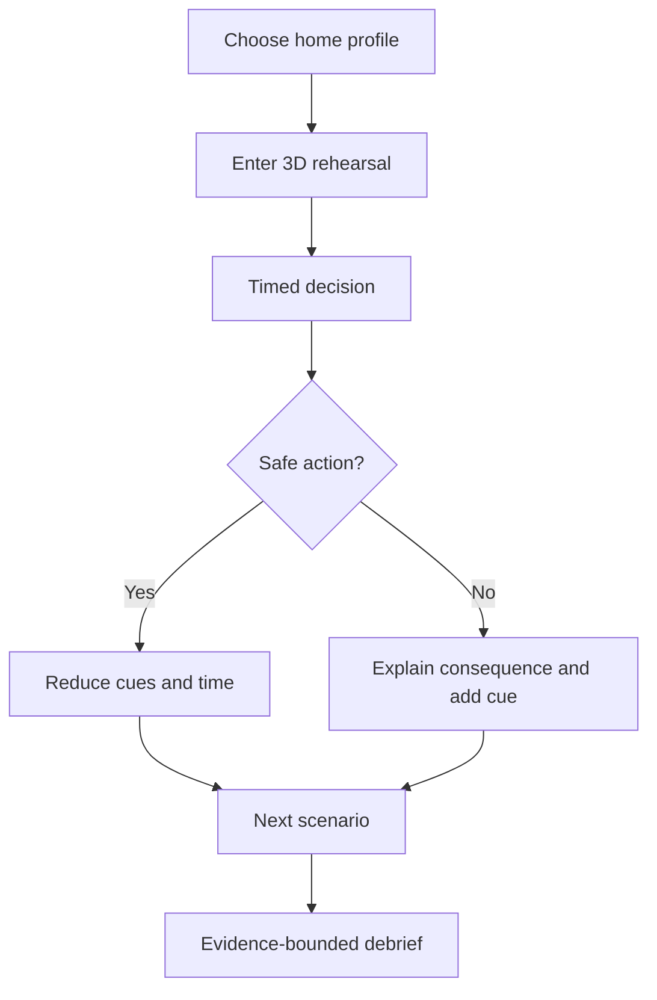
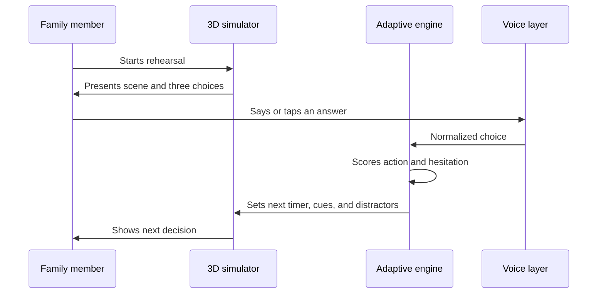

# Product Packet - 90 Segundos

## Problem in my words

Mexico does not lack earthquake information or mass participation. It lacks a cheap way for a family to experience a surprising decision before the real moment. Announced drills teach a route; they rarely expose unsafe instincts, measure hesitation, or change the next rehearsal.

## Exact user

Mariana, 39, lives in an apartment in Mexico City with her mother and a 10-year-old child. She uses her phone every day, has joined workplace drills, and knows the phrase "no corro, no grito, no empujo," but her family has never decided who helps her mother, where they meet, or what to do if the exit is unsafe.

## Success definition

Before the module closes, a user can open a live URL on a phone, enter a 3D home rehearsal, make three timed safety decisions by touch or optional voice, receive an evidence-bounded debrief, and see the next round adapt to their errors. At least one mechanical defect and one persona confusion will be fixed and redeployed.

## Image-generated mockup

Generated before implementation. The build may simplify visual detail to preserve speed, accessibility, and browser compatibility.

## Flow

## Global benchmark line

- Tokyo's 4DOH shows that multi-sensory 3D disaster rehearsal can create an intense shared experience. 90 Segundos localizes the principle to an ordinary phone and a private Mexican home scenario.
- RoT Studio's Earthquake Awareness Training shows adult and child VR/MR modes for actions before, during, and after an earthquake. 90 Segundos differs by making the first slice browser-based and by exposing its simple adaptive rule after every decision.
- DHS's first-responder VR market assessment confirms that VR training systems are a real operational category. 90 Segundos deliberately starts below that hardware and procurement threshold.

The translation problem is access and context: an imported headset program assumes equipment, facilitation, and scenarios that many Mexican families and small organizations do not have. INEGI reported in 2026 that 84.6% of people age six or older used a cellphone in 2025, while only 44.7% of households had a computer. The first Mexican version should therefore be phone-first and degrade gracefully before it becomes headset-first.

## Long view

In three years the full product could be a scenario authoring and measurement layer for certified civil-protection providers. A school, business, or housing association could configure a location-specific rehearsal, run it on phones or headsets, and compare anonymous behavior across attempts. The load-bearing walls are local scenarios, explicit evidence boundaries, accessibility, and adaptive practice rather than photorealism alone.

## Scope cut

- No earthquake prediction or live alert.
- No certification or claim of legal compliance.
- No real personal data, accounts, database, or risk score.
- No graphic injury, panic manipulation, or dead-person likeness.
- No full WebXR headset mode in this slice; the 3D simulation is inline WebGL and explicitly labeled. WebXR is a later capability after device detection and supervised testing.

## Architecture and stack

| Layer | Choice | Why |
|---|---|---|
| Experience | Vite + vanilla JavaScript | Small, inspectable, fast on phones |
| 3D simulation | Three.js inline WebGL | Real-time room scene without requiring a headset |
| Adaptive logic | Local deterministic state machine | Explainable, testable, no fake AI claim |
| Voice | Browser SpeechRecognition when supported | Third Dragon Stack capability; optional and labeled |
| Data | Session memory only | No personal data or open database |
| Hosting | Vercel | Course-required live delivery |

## Security floor

- No secrets or environment variables required.
- No personal data is stored or transmitted.
- Voice is opt-in and disabled when unsupported.
- Every input is constrained to known choices A, B, or C.
- Demo uses invented personas only.

## Test plan

1. Engine scores correct and incorrect decisions deterministically.
2. Correct streak reduces cues and available time within a safe minimum.
3. Error increases guidance without creating an endless scenario.
4. Touch choices work with keyboard and screen readers.
5. Voice parser accepts Spanish letters and option phrases but rejects unknown speech.
6. Timer expiry records a distinct hesitation event.
7. Restart clears session state.
8. Mobile viewport has no horizontal overflow.
9. Reduced-motion preference disables strong scene shake.
10. Unsupported WebGL or voice receives a labeled fallback.

## Sources checked

- W3C, WebXR Device API: https://www.w3.org/TR/webxr/
- U.S. DHS, Virtual Reality Training Systems for First Responders: https://www.dhs.gov/science-and-technology/saver/virtual-reality-training-systems-first-responders
- Tokyo Metropolitan Government, 4DOH: https://www.tokyoupdates.metro.tokyo.lg.jp/en/post-643/
- RoT Studio, Earthquake Awareness Training: https://rotstudio.com/earthquake-awareness-training/
- INEGI, ENDUTIH 2025 results (published 2026): https://www.inegi.org.mx/contenidos/saladeprensa/boletines/2026/endutih/ENDUTIH_25.pdf
